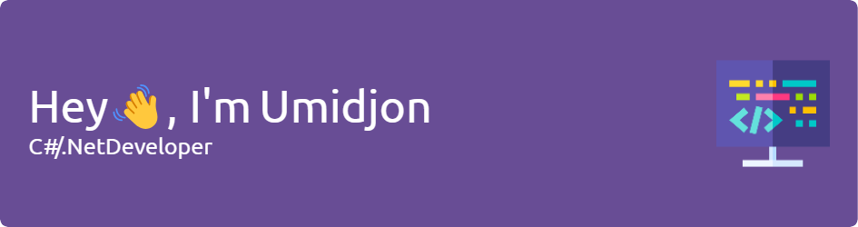
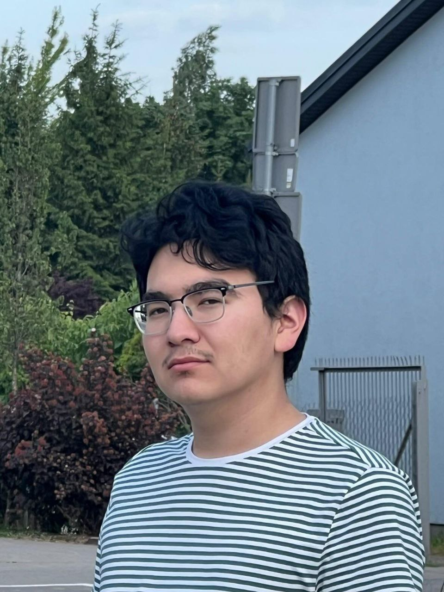

_I eat too much cookies_ 🍪🍪🍪

You probably have never heard of me, just like I have never heard of you, however I am happy to see you interested in my page.
I never thought I will be writing a READme.md for myself, but here I am. So if you are on my profile page, please, READ me.  
  

    

<h2>I am a Computer Engineering student, C#/.NET/Python Developer and big Video Games lover</h2>
I am third year computer engineering student at Vistula University, based in Poland, Warsaw. My specialization is Cybersecurity and Netwroking. In my repos, you can various projects, I would like to hear your opinion on them!
 
- 👾I am a comptuer games enthusiast and love making my own games
- 💻I have big passion to learn everything about programming. Currently learning C#, Python and Java
- 🙌Would love to colloborate on projects
- 💼Currently looking for openning position as Developer

<strong>Languages and Programs I work with:</strong>

<strong>You can find and contact me on:</strong>

)

